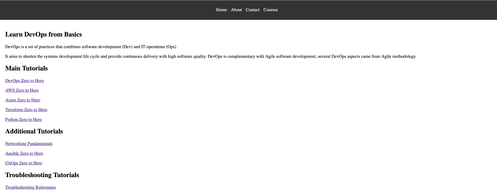

# Go Web App — DevOps End-to-End Project

A Go-based web application demonstrating a complete DevOps pipeline: from local development through containerization, Kubernetes deployment, and fully automated CI/CD with GitHub Actions.



---

## Tech Stack

| Layer | Technology |
|---|---|
| Application | Go (`net/http`) |
| Containerization | Docker (multi-stage, distroless) |
| Orchestration | Kubernetes |
| Package Manager | Helm |
| CI/CD | GitHub Actions |
| Registry | Docker Hub |

---

## Project Structure

```
.
├── main.go                        # Go HTTP server (4 routes)
├── main_test.go                   # Unit tests
├── Dockerfile                     # Multi-stage Docker build
├── go.mod
├── static/                        # HTML pages served by the app
│   ├── home.html
│   ├── courses.html
│   ├── about.html
│   └── contact.html
├── k8s/manifest/                  # Raw Kubernetes manifests
│   ├── deployment.yaml
│   ├── service.yaml
│   └── ingress.yaml
├── helm/go-web-app-chart/         # Helm chart
│   ├── Chart.yaml
│   ├── values.yaml
│   └── templates/
│       ├── deployment.yaml
│       ├── service.yaml
│       └── ingress.yaml
└── .github/workflows/
    └── ci.yaml                    # GitHub Actions CI/CD pipeline
```

---

## Running Locally

**Prerequisites:** Go 1.22+

```bash
git clone https://github.com/armansheikhhosseini/go-web-app-devopsified.git
cd go-web-app-devopsified
go run main.go
```

Open [http://localhost:8080/home](http://localhost:8080/home) in your browser.

**Run tests:**

```bash
go test -v ./...
```

---

## Docker

**Build and run locally:**

```bash
docker build -t go-web-app .
docker run -p 8080:8080 go-web-app
```

The Dockerfile uses a **multi-stage build**:
- Stage 1: `golang:1.22.5` — compiles the binary
- Stage 2: `gcr.io/distroless/base` — minimal, secure runtime image with no shell

---

## Kubernetes Deployment

**Using raw manifests:**

```bash
kubectl apply -f k8s/manifest/
```

**Using Helm:**

```bash
helm install go-web-app ./helm/go-web-app-chart
```

To upgrade with a new image tag:

```bash
helm upgrade go-web-app ./helm/go-web-app-chart --set image.tag=<new-tag>
```

The Helm chart supports:
- Configurable replica count
- Image repository and tag overrides
- Optional Ingress with nginx class

---

## CI/CD Pipeline

The GitHub Actions workflow (`.github/workflows/ci.yaml`) runs on every push to `main` with 4 sequential jobs:

```
build → code_quality → push → update-newtag-in-helm-chart
```

| Job | What it does |
|---|---|
| `build` | Compiles the Go binary and runs unit tests |
| `code_quality` | Runs `golangci-lint` for static analysis |
| `push` | Builds and pushes the Docker image to Docker Hub, tagged with the GitHub run ID |
| `update-newtag-in-helm-chart` | Updates `values.yaml` with the new image tag and commits back to `main` |

**Required GitHub Secrets:**

| Secret | Description |
|---|---|
| `DOCKER_USERNAME` | Docker Hub username |
| `DOCKER_PASSWORD` | Docker Hub password or access token |
| `SEC_TOKEN` | GitHub personal access token (for pushing the Helm tag commit) |

---

## Key Design Decisions

- **Distroless base image** — eliminates shell access and reduces the attack surface in production
- **Helm over raw manifests** — enables parameterized, repeatable deployments across environments
- **Run ID as image tag** — every CI run produces a unique, traceable image; no `latest` drift
- **Automated Helm tag update** — keeps the Git repository as the single source of truth for the deployed image version (GitOps pattern)

---

## Author

**Arman Sheikhhosseini**
- GitHub: [github.com/armansheikhhosseini](https://github.com/armansheikhhosseini)
- Email: cloude.2032@gmail.com
